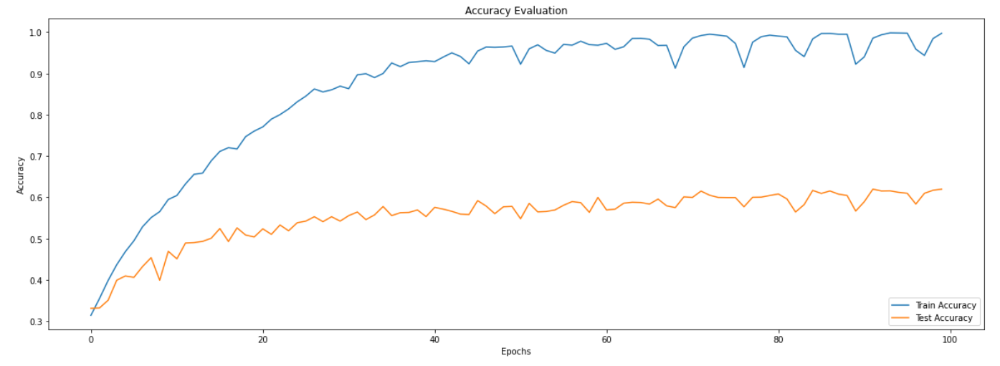
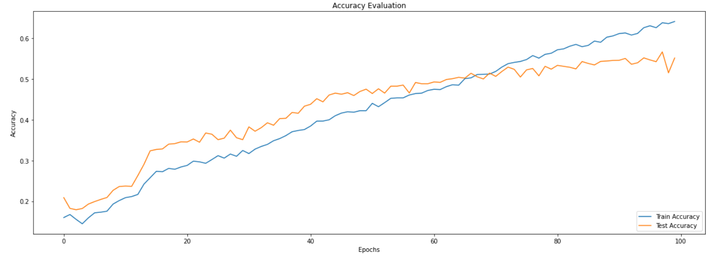
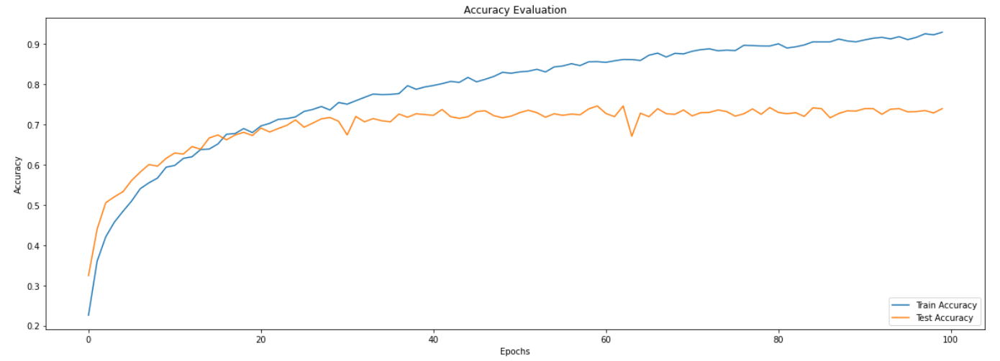
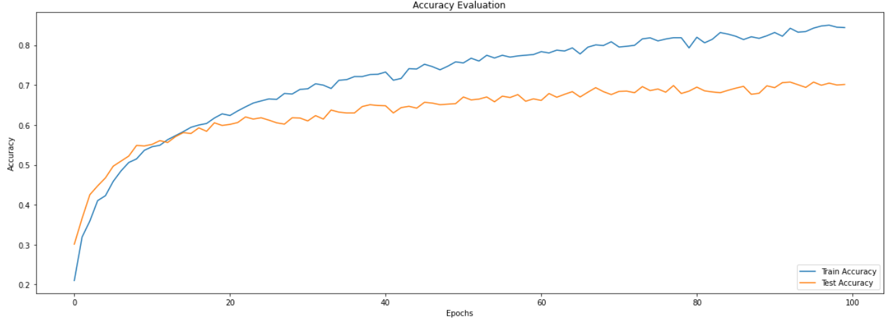

# Audio Genre Classification

In this project, I will implement the classification of 
music files based on the genres. Generally, people 
carry their favorite songs on smartphones. Songs can be of various 
genres. With the help of deep learning techniques,
we can provide a classified list of songs to the smartphone user.
We will apply deep learning algorithms to create models, which
can classify audio files into various genres. After training the model, 
we will also analyze the performance of our trained model.

# Dataset

We will use [GTZAN dataset](https://www.kaggle.com/andradaolteanu/gtzan-dataset-music-genre-classification), which contains 1000 music files. 
Dataset has ten types of genres with uniform distribution. 
Dataset has the following genres: blues, classical, country,
 disco, hiphop, jazz, reggae, rock, metal, 
and pop. Each music file is 30 seconds long.

  
   

  
   

  
   

  
   

  
   

# Preprocessing
    
    
- The audio files are normalized sampled on a mono channel at a sampling 
  rate of 22050 Hz .

- We go to each song of each genre and break it into 10 segments 
  of equal length.  

- We choose certain parameters given as  

        1. Number of Mel Frequency Cepstral coefficents (n_mfcc = 13)

        2. Frame length (n_fft = 2048)

        3. Hop Length (hop_length = 512)

- Then we extract these features from each segment and store 
  them with their genre label in a dictionary.

# Model Building

**Simple ANN**
    
- Built a simple artificial nueral networks with the following architecture
        
        1. Flatten Layer with the Input shape = (130,13)
        2. Dense Layer with 512 units and Rectified Linear Unit(ReLu) activation function
        3. Dense Layer with 256 units and ReLu activation function
        4. Dense Layer with 64 units and ReLu activation function
        5. Output Dense Layer with 10 units and softmax activation function

- Compiled the model using Adam optimizer having a learning rate of 
  0.0001 with sparse categorical cross entropy as the loss function

- Trained for 100 epochs getting a validation accuracy of 61.98%

**Simple ANN with Dropouts and L2-Regularization**
    
- Modified the above architecture as follows
        
        1. Flatten Layer with the Input shape = (130,13)
        2. Dense Layer with 512 units and ReLu activation function and a l2 regularization factor
           of 0.0001
        3. Dropout Layer with a dropout ratio of 0.3
        4. Dense Layer with 256 units and ReLu activation function and a l2 regularization factor
           of 0.0001
        5. Dropout Layer with a dropout ratio of 0.3
        6. Dense Layer with 64 units and ReLu activation function and a l2 regularization factor
           of 0.0001
        7. Dropout Layer with a dropout ratio of 0.3
        8. Output Dense Layer with 10 units and softmax activation function

- Compiled the model using Adam optimizer having a learning rate of 
  0.0001 with sparse categorical cross entropy as the loss function

- Trained for 100 epochs getting a validation accuracy of 68.00%

**Convolutional Nueral Network**
    
- Conv2D takes input of shape (#samples,length,height,#channels) here we have of 
  shape (#samples,length,height) which mimics a grayscale image hence we expand 
  our input dims to have a shape of (#samples,length,height,1)
  

- Built a shallow CNN model with the following architecture
        
        1. Conv2D Layer with 32 kernels and kernel shape of (3,3) taking inputs of shape (130,13,1)
           and ReLu as activation function
        2. MaxPooling2D Layer with "same" padding, pool size of (3,3) and stride of (2,2)
        3. Batch Normalization Layer
        4. Conv2D Layer with 32 kernels and kernel shape of (3,3) taking inputs of shape (130,13)
           and ReLu as activation function
        5. MaxPooling2D Layer with "same" padding, pool size of (3,3) and stride of (2,2)
        6. Batch Normalization Layer
        7. Conv2D Layer with 32 kernels and kernel shape of (2,2) taking inputs of shape (130,13)
           and ReLu as activation function
        8. MaxPooling2D Layer with "same" padding, pool size of (2,2) and stride of (2,2)
        9. Batch Normalization Layer
       10. Flatten Layer
       11. Dense Layer with 64 units and ReLu activation function
       12. Output Dense Layer with 10 units and softmax activation function

- Compiled the model using Adam optimizer having a learning rate of 
  0.0001 with sparse categorical cross entropy as the loss function

- Trained for 100 epochs getting a validation accuracy of 73.97%

**Vanilla LSTMs**
    
- Built a stacked LSTM networks with the following architecture
        
        1. LSTM Layer with 64 units, Input shape = (130,13), return_sequences = True
           and hyperbolic tan(tanh) as activation function
        2. LSTM Layer with 64 units and tanh as activation function
        3. Dense Layer with 64 units and ReLu activation function
        4. Dropout Layer with a dropout ratio of 0.3
        5. Output Dense Layer with 10 units and softmax activation function

- Compiled the model using Adam optimizer having a learning rate of 
  0.0001 with sparse categorical cross entropy as the loss function

- Trained for 100 epochs getting a validation accuracy of 66.60%

 

## Acknowledgements

 - [ValerioVelardoTheSoundofAI](https://www.youtube.com/c/ValerioVelardoTheSoundofAI/featured)
 - [Sound of AI Slack community](https://valeriovelardo.com/the-sound-of-ai-community/)

